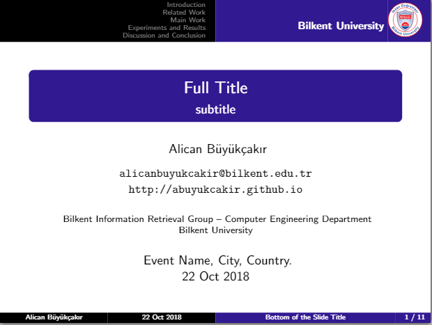

# bilkent-beamer-template
## LaTeX Beamer Template for Bilkent University

Beamer is a LaTeX package that allows you to create professional / scientific presentations in LaTeX.

I modified the beamer template for Radboud University Nijmegen (see http://www.cs.ru.nl/~pim/beamer.php) and created a template for Bilkent University. The main color of the template is, as expected, Bilkent's traditional blue. Also, there is Bilkent's logo (english version) in the top right corner of each page.

Here is a sample title page for your presentation:

